# Magzic — AI-Powered Inventory Management SaaS

**Stop guessing what is in stock.** Magzic connects invoices, warehouses and operations so stock problems are visible before they stop the business.

Magzic is a mobile-first inventory management SaaS for small and medium businesses. It combines inventory, warehouses, invoices, contractors, stock movements, operational packages, alerts and an AI-assisted invoice parser in one system.

- **Live:** [magzic.com](https://magzic.com)
- **Repository:** [github.com/gigix119/magzic](https://github.com/gigix119/magzic)

---

## Why Magzic exists

Small businesses often manage inventory through Excel, messages and memory. Products are spread across multiple locations, invoices are not connected to stock, shortages are discovered too late and owners do not have one clear operational view.

Magzic was built to fix that: one system where invoices, stock levels, warehouse locations and operational decisions are connected and visible in real time.

---

## What Magzic does

Magzic connects product catalog, warehouse locations, invoices, stock movements, alerts, operational packages and AI assistance into one workflow. Instead of switching between spreadsheets and paper notes, the user gets a single view of what is in stock, where, and what changed.

---

## Key workflows

### 1. Product and stock management

- Product catalog with units, categories and SKU
- Stock status per product: OK / low / out of stock
- Manual stock increase and decrease
- Full stock movement history
- Threshold-based low-stock and out-of-stock configuration

### 2. Multi-location warehouse management

- Products can be assigned to specific warehouses and locations
- Stock can be transferred between locations
- Example: before a long weekend, a business can move cleaning supplies or spare parts from one location to another — from Jastarnia to Mechelinki — so the right team has the right stock on site

### 3. Invoice workflow

- Purchase invoices with draft and approved states
- NETTO / BRUTTO price mode per invoice
- Manual invoice entry form
- Approved invoices automatically update stock levels
- Rollback option for approved invoice stock movements

### 4. AI-assisted invoice parser

Magzic includes an AI-assisted parser for text-based PDF invoices. The parser reads invoice data, detects invoice positions, matches products from the catalog, estimates confidence and shows warnings before anything is approved.

**Parser logic:**

- If the product already exists in the catalog, Magzic matches it to the invoice position
- If the product does not exist, the user can click "Create product" directly from the invoice row
- A new product can be created and assigned to a warehouse/location without leaving the invoice flow
- Stock is **not** increased during the preview step
- Stock increases **only after the invoice is approved**
- This prevents accidental inventory changes from unreviewed documents

> The current parser works with text-based PDF invoices (PDFs with a text layer). OCR for scanned documents and image/receipt parsing from phone photos are planned for a future release.

### 5. Operational / cleaning packages

Magzic supports operational packages. A package is a reusable set of products required for an operation — for example a cleaning or service job.

- Packages can contain any number of products with quantities
- Executing a package deducts those products from stock automatically
- Example: a cleaning package containing 10 LED bulbs, cleaning chemicals or other supplies. One tap executes the package and stock is updated

### 6. Smart alerts and assistant

- Low-stock and out-of-stock alerts
- Price anomaly detection across invoices
- Invoices flagged as requiring review
- Assistant quick prompts for operational analysis
- Operational overview without manually searching through tables

### 7. Admin backend and invoice model monitoring

Magzic includes an owner/admin backend with user overview, activity, permissions and audit log.

The invoice model section tracks extraction logs, corrections, model settings and training/evaluation tools. This makes the parser observable and easier to improve over time — the owner can see which positions were extracted correctly, which were corrected and how the model is performing across documents.

---

## Screenshots

### Landing page

  

*Landing page explains the core promise: AI-assisted inventory management for small and medium businesses.*

  

*Problem section shows the operational chaos Magzic is designed to reduce.*

  

*Workflow section explains how products, invoices and AI insights connect.*

  

*Feature section presents the main product modules.*

  

*AI section shows that AI is used for operational decisions, not decorative chat.*

---

### Desktop application

  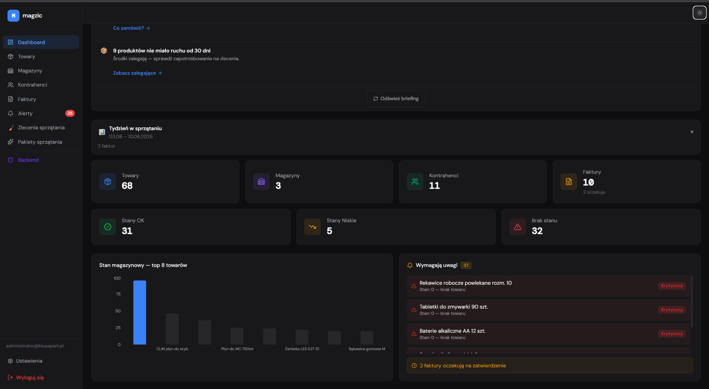

*Dashboard gives a quick overview of stock health, invoices, alerts and recent activity.*

  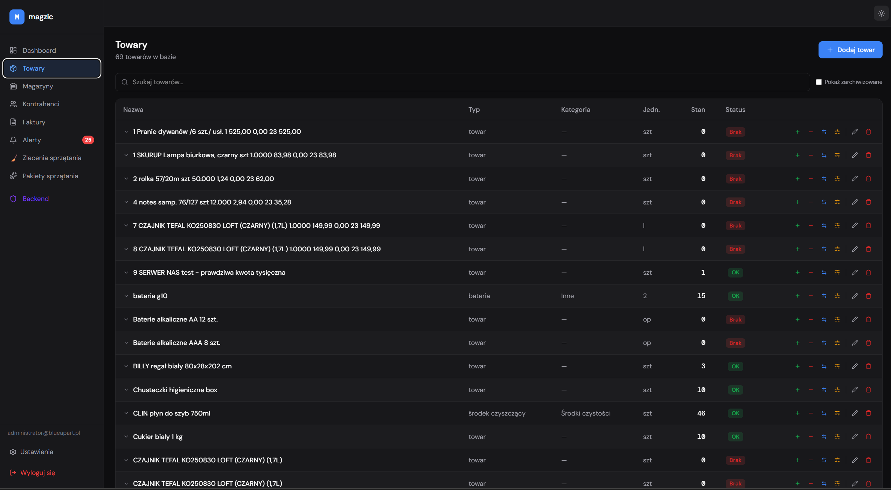

*Products view manages the full inventory catalog with stock actions and movement history.*

  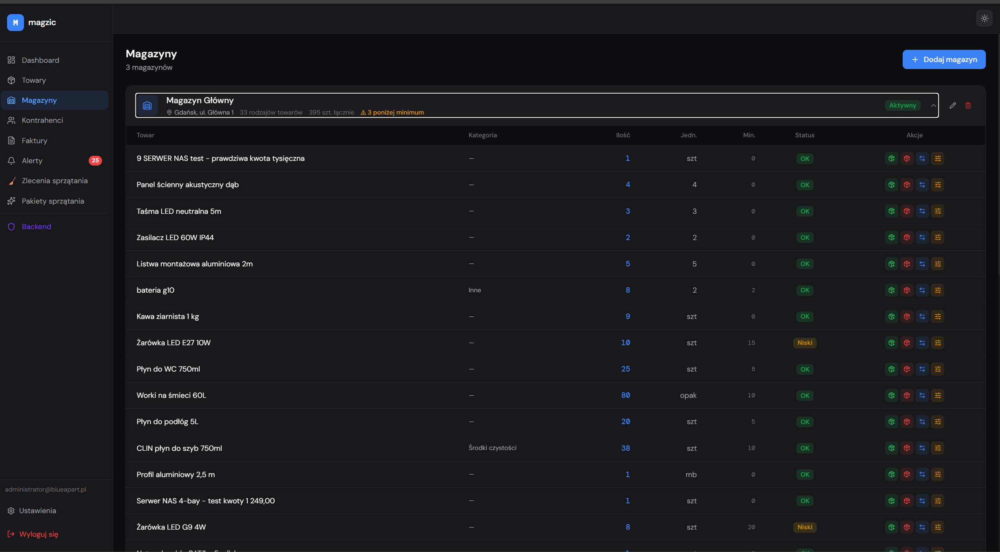

*Warehouses view shows stock per location and supports multi-location transfers.*

  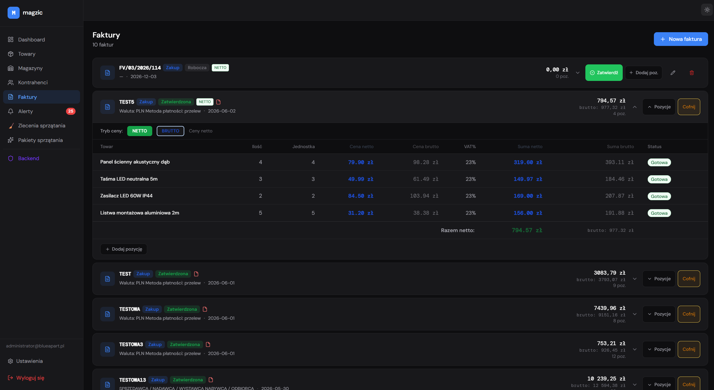

*Invoices view connects purchase documents with stock updates in one workflow.*

  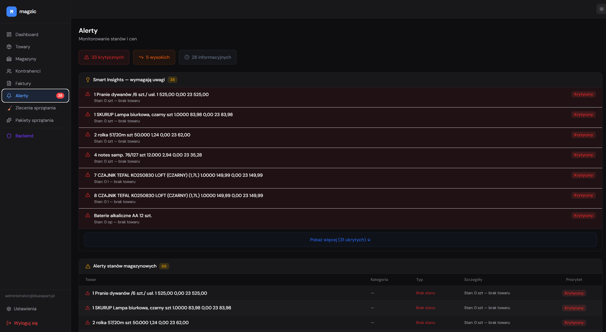

*Alerts surface critical stock problems — low stock, out of stock and price anomalies.*

  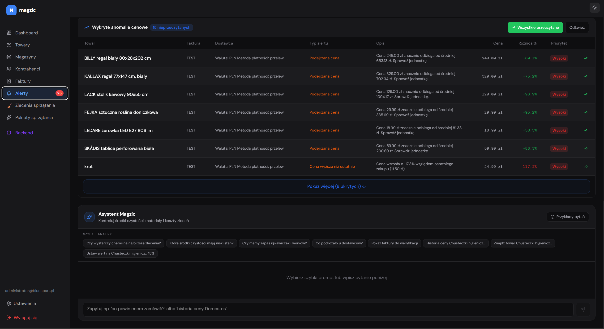

*Assistant panel shows price anomalies across invoices and offers quick operational prompts.*

  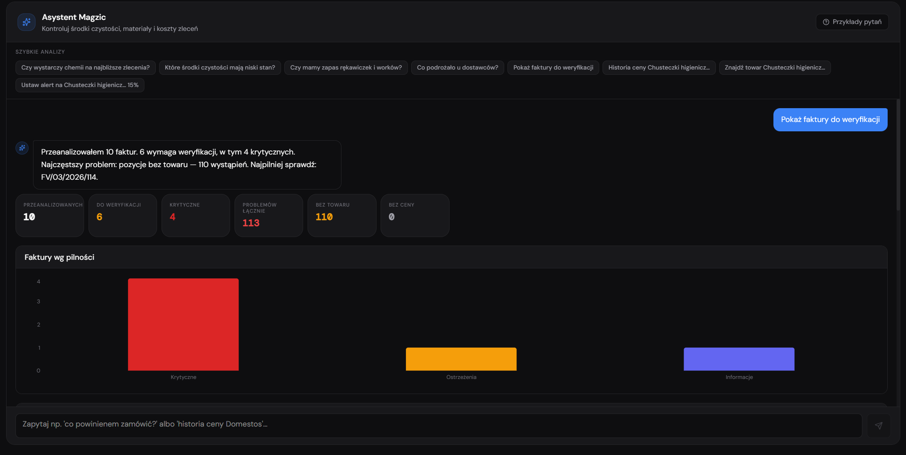

*Assistant invoice analysis gives a structured view of invoice data without manual table searching.*

  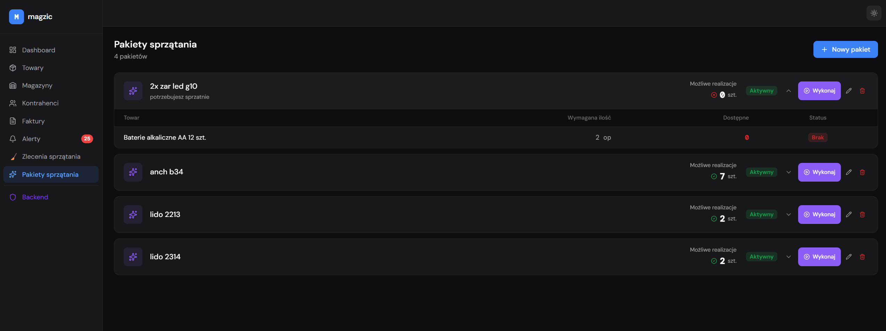

*Operational packages are reusable stock consumption templates for cleaning, service or maintenance jobs.*

---

### AI invoice parser

  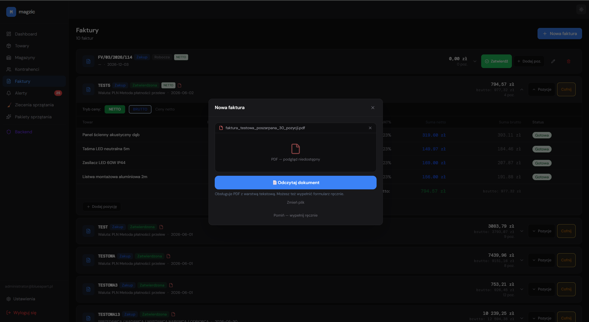

*Upload modal starts the invoice import flow — the user picks a PDF and the parser begins extraction.*

  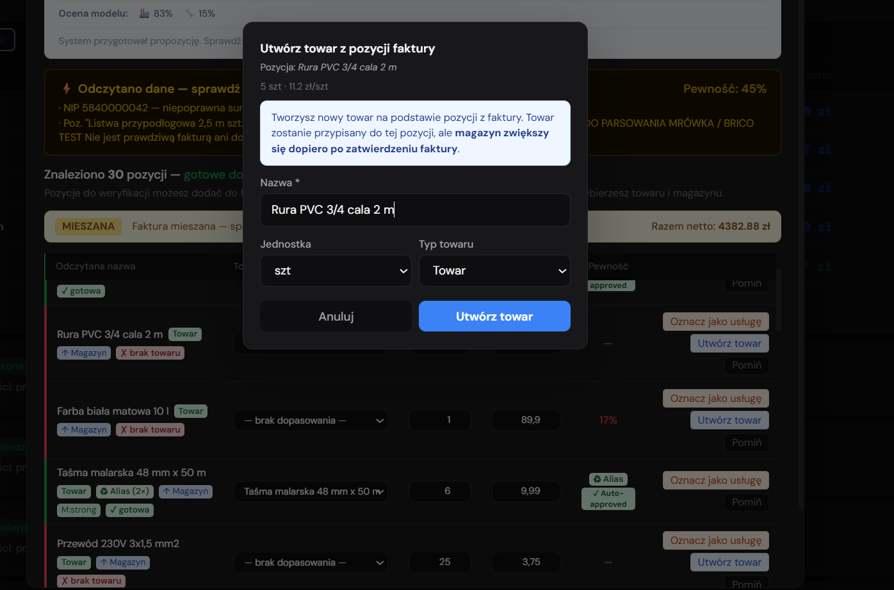

*Parser review screen shows extracted positions, confidence scores, matched products and verification state.*

  

*Product creation from invoice positions: missing items can be added directly from the invoice row and assigned to a warehouse immediately.*

  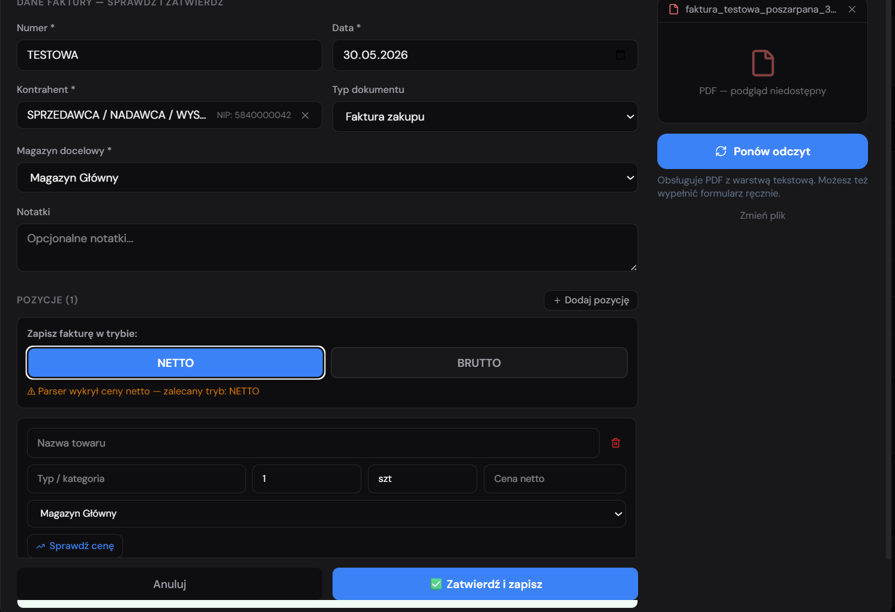

*Manual invoice entry with NETTO/BRUTTO toggle — available when the parser cannot handle a document or for manual corrections.*

---

### Backend and model monitoring

  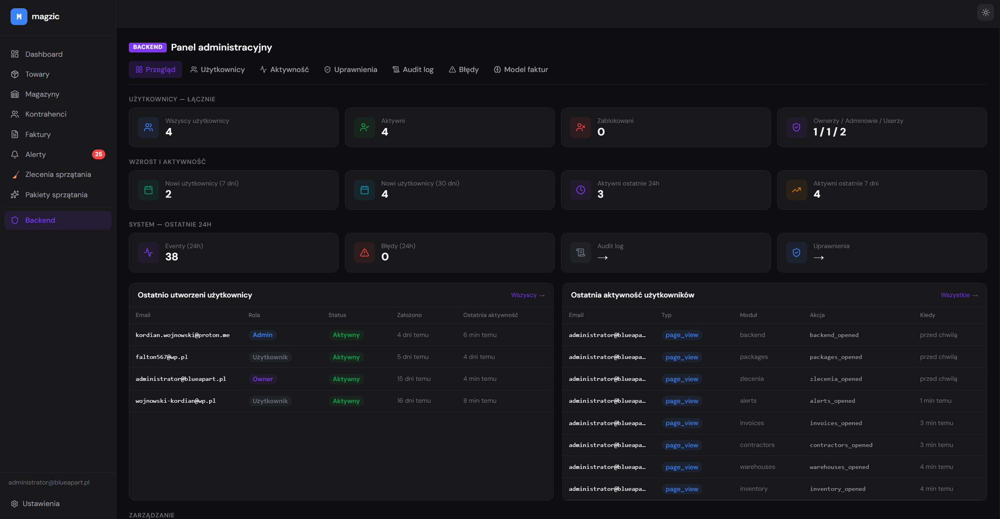

*Admin backend gives the owner visibility into users, activity, permissions and system state.*

  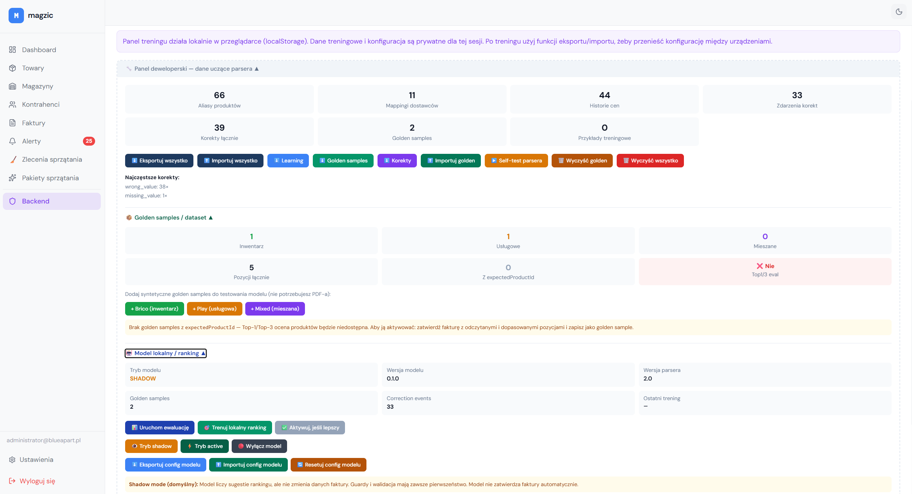

*Invoice model panel helps monitor extraction quality and improve parser behavior over time.*

---

## Mobile-first experience

Magzic is not only responsive — the product is designed mobile-first. Core workflows are available on a phone: dashboard, navigation, products, warehouses, contractors, invoices, settings, service orders and alerts. The layout adapts to small screens without losing information density.

  
  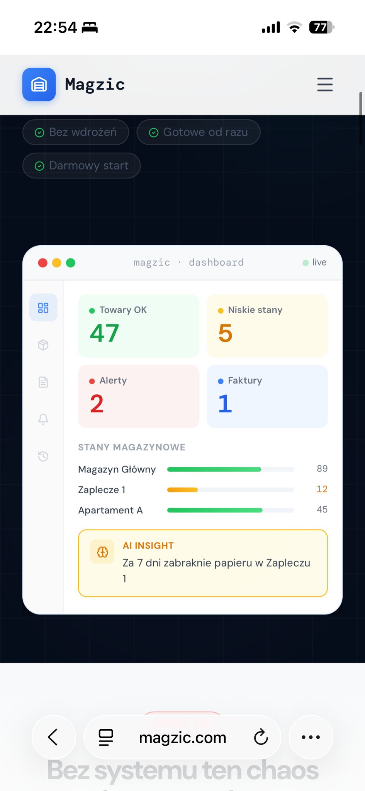
  

  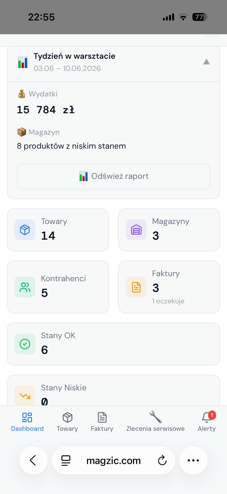
  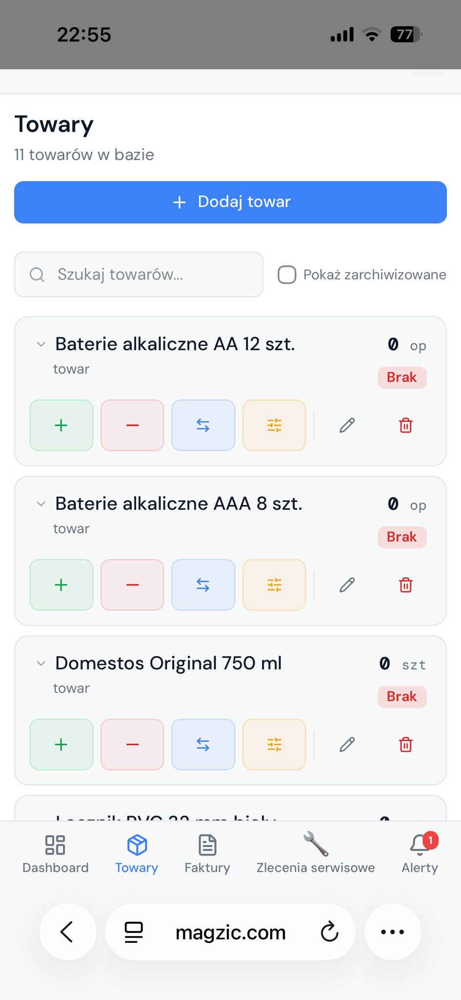
  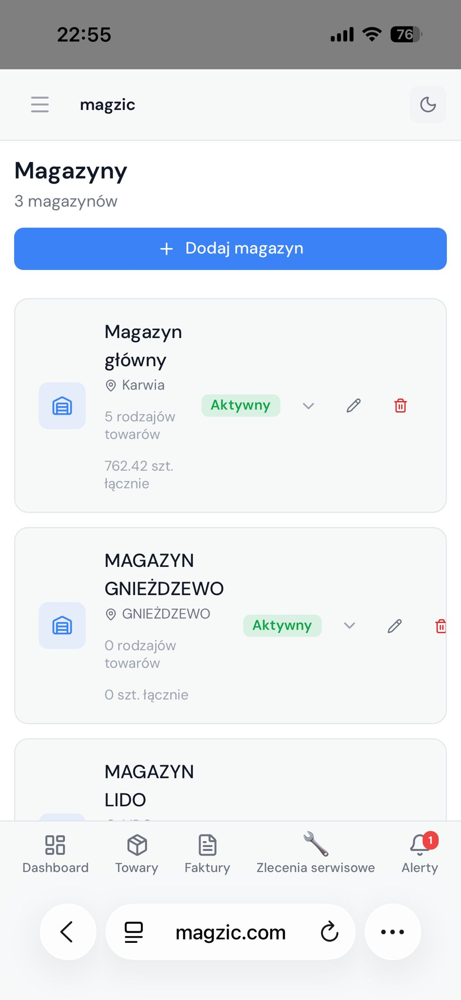

  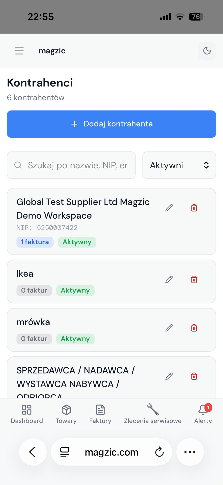
  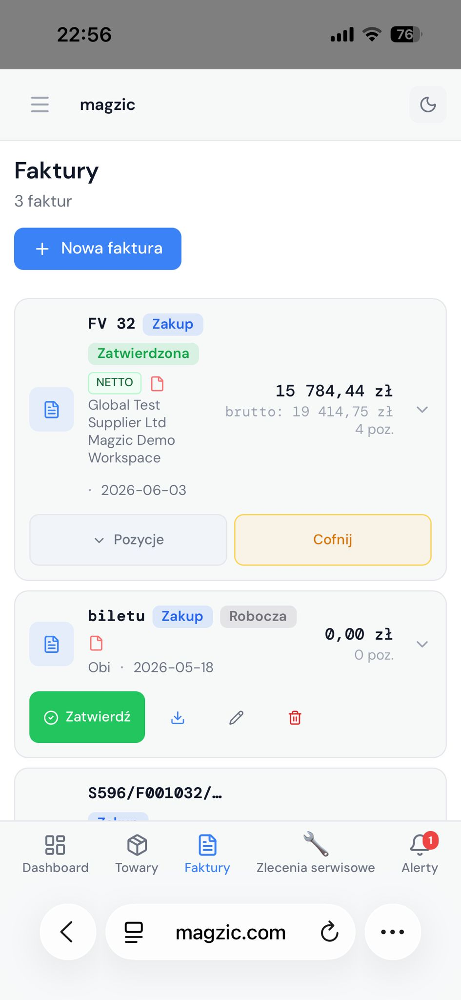
  

  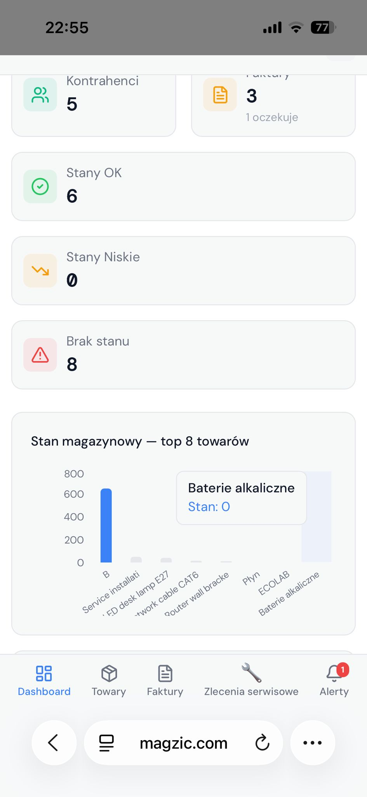

---

## Tech stack

| Layer | Technology |
|---|---|
| Frontend | React 19, Vite 8 |
| Routing | React Router v7 |
| Styling | Tailwind CSS v4 |
| Icons | Lucide React |
| Charts | Recharts |
| PDF parsing | pdfjs-dist |
| Backend / DB | Supabase (PostgreSQL) |
| Auth | Supabase Auth |
| Row-level security | Supabase RLS |
| Deployment | Cloudflare Pages |
| Testing | Vitest |

---

## Architecture

Magzic is a single-page React application backed by Supabase.

**Frontend:**
- React + Vite with file-based routing via React Router
- Tailwind CSS for styling
- Recharts for dashboard charts and analytics
- pdfjs-dist for client-side PDF text extraction

**Backend (Supabase):**
- PostgreSQL with Row Level Security for multi-tenant data isolation
- Supabase Auth for workspace-scoped authentication
- Realtime subscriptions for live alert and stock updates

**Data model:**
- `products` — catalog with units, categories, SKU and stock thresholds
- `warehouses` — named locations; products can be assigned to multiple locations
- `stock_movements` — append-only log of every stock change with source reference
- `contractors` — supplier/contractor records
- `invoices` + `pozycje_faktury` — invoice header and line items with draft/approved state
- `alerts` — low stock, out-of-stock and price anomaly records
- `packages` — reusable operational stock sets
- `zlecenia` — service orders tied to packages and locations
- `invoice_model_logs` — extraction log for parser review queue and model improvement
- `profiles` + workspace tables — multi-tenant workspace and user management
- `backend_*` — admin tables for owner-level overview

---

## AI / Parser design

The current parser focuses on text-based PDF invoices. The extraction pipeline:

1. **Text extraction** — pdfjs-dist reads the PDF text layer and preserves position data
2. **Layout analysis** — the parser detects column boundaries from x-coordinates
3. **Table detection** — invoice rows are identified from vertical position clusters
4. **Column mapping** — LP (position number), product name, quantity, unit, net price, gross price, VAT rate columns are assigned
5. **Product matching** — extracted names are matched against the product catalog using aliases and similarity
6. **Confidence scoring** — each position gets a confidence score; low-confidence rows are flagged for user review
7. **Approval gate** — stock is not updated until the user explicitly approves the invoice

The parser can be improved over time through alias management, correction history, extraction logs, review queues and local training/evaluation tools available in the backend panel.

> OCR for scanned invoices and image-based receipt parsing from phone photos are on the roadmap.

---

## Roadmap

- [ ] OCR for scanned invoices
- [ ] Image-based receipt and invoice parsing from phone photos
- [ ] Improved product matching models and alias learning
- [ ] Automatic supplier price comparison across invoices
- [ ] Demand forecasting per location
- [ ] Smarter reorder recommendations
- [ ] Richer mobile workflows (stock actions, package execution)
- [ ] SaaS onboarding flow and pricing tiers
- [ ] Team roles and permission improvements
- [ ] Export and reporting features

The goal is to let the user upload a photo of a receipt or invoice, extract products and amounts, match them to the catalog and update warehouse stock — all after a quick verification step.

---

## What I learned

This project is not a single feature demo. Building Magzic required combining:

- **Frontend engineering** — complex React state, multi-step forms, mobile-first responsive layouts, PDF rendering and real-time updates
- **Database design** — relational schema for multi-tenant SaaS with stock movement integrity, invoice approval state machines and RLS policies
- **Authentication and workspaces** — Supabase Auth with workspace-scoped data access
- **Parser engineering** — layout-aware text extraction, column detection, product matching and confidence scoring without a paid API
- **Admin tooling** — backend panel with extraction logs, model monitoring and review queues
- **UX decisions** — approval gates, rollback flows, confidence warnings and safety modals to prevent accidental data changes

The combination of these layers — not any single one — is what makes Magzic work as a real product.

---

## Security / demo data note

Screenshots use demo/test data and owner-approved admin/demo accounts. This repository does not include production secrets, `.env` files, Supabase service role keys, real invoices or customer data.

Deployment and environment variables are configured outside the repository in the hosting provider dashboard.

---

## Important note

The project is actively developed. Some AI/parser features depend on an optional server-side endpoint (`VITE_INVOICE_AI_ENDPOINT`) that is not included in this repository. The local text-based PDF parser works without any external service.

---

## Author

**Kordian Wojnowski**
